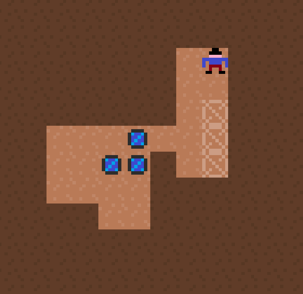

# sokobalt

A kind of Sokoban, a 1981 puzzle game where the player pushes crates in a warehouse

Similar projects 
- [solver in java](https://github.com/jameshong92/sokoban-solver)
- [game in python](http://inventwithpython.com/blog/2011/06/13/new-game-source-code-star-pusher-sokoban-clone/)

# Levels

[Level format](http://sokobano.de/wiki/index.php?title=Level_format)

|symbol|description|
|---|---|
| @ | player starting position |
| $ | box starting position |
| . | goal position |
| + | a goal where the player starts. Can't have @ and + in the same level |
| * | a goal where a box also starts |
| # | wall |
| (space) | empty |

Lines starting with any other character are comments should be ignored.
Levels are separated by at least one empty line or comment. 

Levels:
- [sneezing tiger](http://sneezingtiger.com/sokoban/levels.html)
- [sourcecode.se](http://www.sourcecode.se/sokoban/levels)

# TODO
- navigate through 100 levels in menu
- logging and better `level.__repr__` (want sokoban level format, not list of lists) 
- move history, can undo
- store unlocked levels in a local save pickle
- use bg and DirtySprite instead of redrawing every tick
- level solver (see below)

# Solver
Build a level solving map: starting from start state, enumerate all possible 
game states and organize them in a graph. For each state, compute a solution, 
ie a path from state to the win state.

A*, heuristic is sum of distance of carts to nearest slots. 
Optimize: 1) Limit to depth of 50 or 100, 2) prune off/ignore nodes 
where state was seen higher up in the tree

Player can press H for a hint. 
Hint should be displayed as a blinking arrow on the soonest cart to push 
(ie skip all the player movement to get there). 
Arrow indicates direction to push towards.